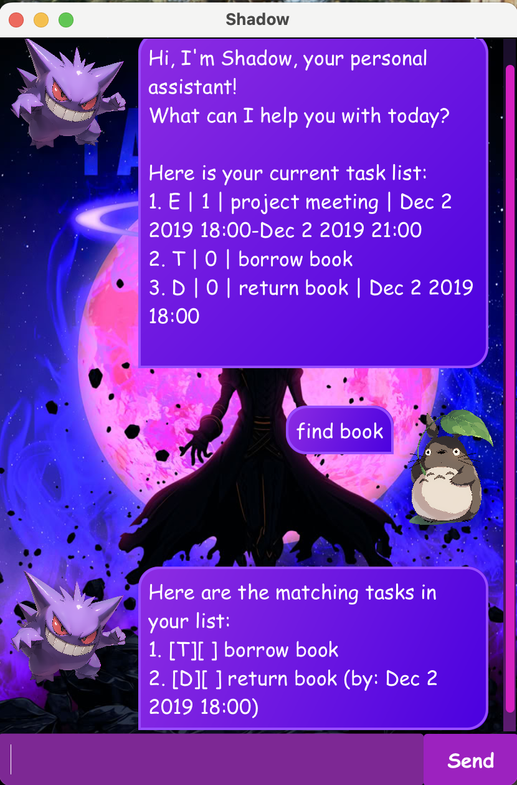

# 🥷🏿 Shadow User Guide

> **"If you fail to plan, you are planning to fail."** – Benjamin Franklin

Greetings, mortal! In the unseen corners of digital space lurks **Shadow** 🌒, the silent orchestrator 
of every mission and task. No task escapes notice, no objective goes untracked. Every step is 
cataloged, every action executed with ruthless precision 🎯. **Shadow** wields the precision of a 
CLI ⚡ while basking in the elegance of a GUI ✨—ensuring order reigns supreme even in the shadows.
All tasks obey **Shadow's** commands without question 👑, leaving no room for chaos.

## Phantom Launch 🚀
1. **Prerequisites** 🔑: Ensure you have **exactly Java 17** installed
    - For Mac users: Install the precise **Azul JDK+JavaFX 17 distribution** specified in this [guide](https://se-education.org/guides/tutorials/javaInstallationMac.html)
    - For Windows/Linux users: Install the [Oracle version](https://www.oracle.com/java/technologies/downloads/#java17) or another alternative such as the OpenJDK version

2. **Download** 📥: Retrieve the latest `.jar` file from [GitHub Releases](https://github.com/yuanz03/ip/releases)

3. **Setup** 🛠: Copy the `.jar` file into your desired empty folder/directory 
   - Open a command window in that folder
4. **Deployment** 🌐: Run the command `java -jar Shadow.jar` in your terminal

## Atomic Features 🌋
Every feature is a silent weapon ⚔️—crafted to track, manage, and conquer your tasks with precision!

### Adding Todos 📝: `todo`
Adds a basic todo task to the Shadow task list.

**Syntax Format**: `todo DESCRIPTION`

**Usage Examples**:
- `todo borrow book`
- `todo buy flowers`

**Output Examples**: Displays the task type, completion status, and task description
- `"[T][ ] borrow book"`
- `"[T][ ] buy flowers"`

### Adding Deadlines 📆: `deadline`
Adds a deadline task with a due date to the Shadow task list.

**Syntax Format**: `deadline DESCRIPTION /by d/M/yyyy HHmm`
- **Caution** ⚠️: Date inputs must strictly follow the format: `d/M/yyyy HHmm`

**Usage Examples**:
- `deadline return book /by 16/9/2025 1800`
- `deadline sell flowers /by 2/10/2025 0600`

**Output Examples**: Displays the task type, completion status, task description, and due date
- `"[D][ ] return book (by: Sep 16 2025 18:00)"`
- `"[D][ ] sell flowers (by: Oct 2 2025 06:00)"`

### Adding Events 🎟: `event`
Adds an event task with a start date and an end date to the Shadow task list.

**Syntax Format**: `event DESCRIPTION /from d/M/yyyy HHmm /to d/M/yyyy HHmm`
- **Caution** ⚠️: Date inputs must strictly follow the format: `d/M/yyyy HHmm`   

**Usage Examples**:
- `event project meeting /from 17/8/2025 1600 /to 17/8/2025 1900`
- `event formal dinner /from 2/11/2025 1800 /to 2/11/2025 2100`

**Output Examples**: Displays the task type, completion status, task description, start date, and end date
- `"[E][ ] project meeting (from: Aug 17 2025 16:00 to: Aug 17 2025 19:00)"`
- `"[E][ ] formal dinner (from: Nov 2 2025 18:00 to: Nov 2 2025 21:00)"`

### Listing Tasks 📋: `list`
Lists all existing tasks in the Shadow task list.

**Syntax Format**: `list`

### Marking Tasks ✅: `mark`
Mark your desired task as completed. 

**Syntax Format**: `mark INDEX`
- **Tip** 💡: `INDEX` represents the task's position in the list, beginning at 1

**Usage Examples**:
- `mark 2`

**Output Examples**: presence of `'X'` indicates the tasks has been completed
- `"[T][X] borrow book"`

### Unmarking Tasks ↩️: `unmark`
Mark your desired task as not completed yet.

**Syntax Format**: `unmark INDEX`

**Usage Examples**:
- `unmark 2`

**Output Examples**: absence of `'X'` indicates the tasks has not been completed yet
- `"[T][ ] borrow book"`

### Deleting Tasks 🗑: `delete`
Deletes your selected task from the Shadow task list.

**Syntax Format**: `delete INDEX`

**Usage Examples**:
- `delete 2`

### Finding Tasks 🔎: `find`
Lists all matching tasks related to your keyword in the Shadow task list.

**Syntax Format**: `find KEYWORD`

**Usage Examples**:
- `find book`
- `find meeting`

### Exiting Shadow 👋: `bye`

**Syntax Format**: `bye`

## Acknowledgements 📑
- Shadow and user avatar images were sourced from this [website](https://www.cleanpng.com)
